# DICE GAME
Dice game is a simple game when you play with other users. 
The aim of the game is to score the highest number of points. 
Check the tutorial below to learn how to play. 
You need to know that the game is only available for login users.

## Technologies
- Kubernetes
- NodeJS
- React
- Bootstrap

## Requirements
- Minikube

## Installation process
You need to do steps below to install this project.

### Install minikube
To install this project you have to need a kubernetes cluster.
The easiest way to get it is install Minikube and kubectl.
Next you need to enable an ingress.
```
minikube addons enable ingress
```
### Install base project
If you properly configure minikube you can install Dice Game. To do that just execute kubectl command below
It will create a two databases Mongo and Postgres, Keycloak authenticator provider and Dice Game API and Dice Game GUI deployment
```
kubectl create -f https://raw.githubusercontent.com/Bartosz95/dice-game/master/k8s/dice-game.yaml
```
### Install admin manager
You can also install Keycloak admin console and Mongo Express to manage games.
```
kubectl create -f https://raw.githubusercontent.com/Bartosz95/dice-game/master/k8s/dice-game-admin.yaml
```
### Set the DNS in hosts
You also need to set your path to application in /etc/hosts on linux.
If you work on another machine, check yourself how to do it.
First you need to know what your minikube IP address is.
```
sudo echo "$(minikube ip) dice-game dice-game-admin" > /etc/hosts
```
It is all now you can open a http://dice-game/ and play.

## Tutorial
To play the game open http://dice-game/. If you install admin console check a next section too

How to use this application? It is very simple. Just check the steps below.

### Login
In the first place you need to be logged in when you want to play this game.
Press the login button on the top right corner of the page to see a login page.
If you have an account you can log in yourself now.
If you don't have any please create one. 
You can also login with available authentication providers as Google, Facebook ect.
You can also create an account manually.
To do that please press the Register button on the bottom of the form.
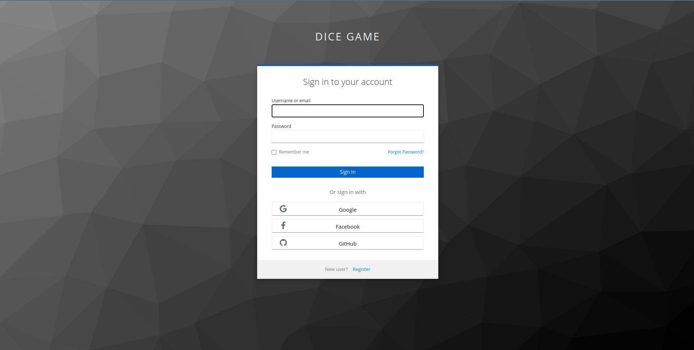


### Register
Register form is quite conventional. 
You need to give your name and email address. 
Choose your username carefully because it will be displayed for other users in the game.


### Create Game
First go to the New Game tab. 
You will see game creators like below. 
Choose the title for your game and add users. 
After you press the "Create" button you will automatically start playing the game.
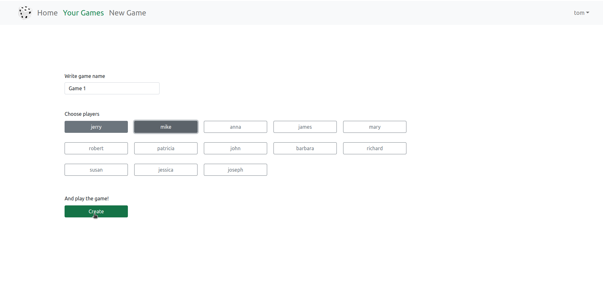

### Roll all 5 dices
When you start a new game you will see a page like below.  
Generally the green fields are interactive.
First you need to roll all the dice.
Press the green "Roll all dices" button to make a move.
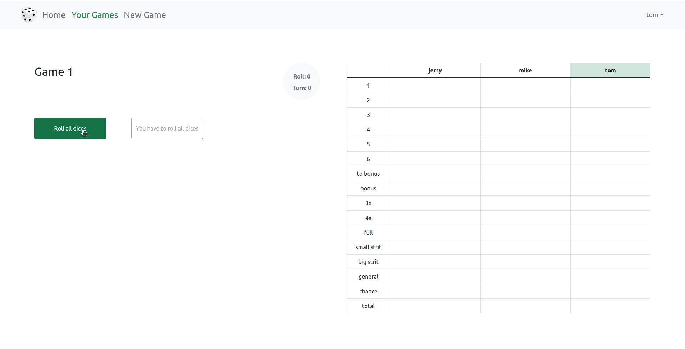


### Second roll
Now you can see what dice numbers you have. 
You have to decide whether you want to choose a figure or continue playing.
Let's assume that you want to roll the first two dice.
Mark them firstly.
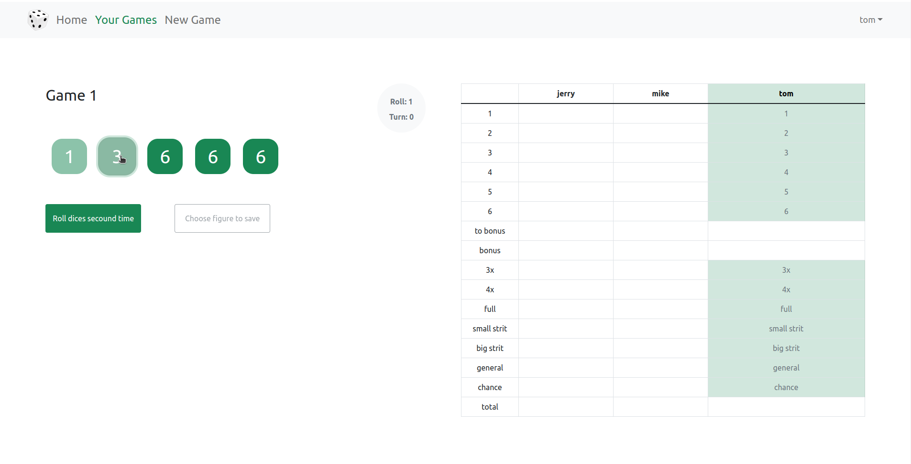

After you check the dicess press the "Roll the dice" button.
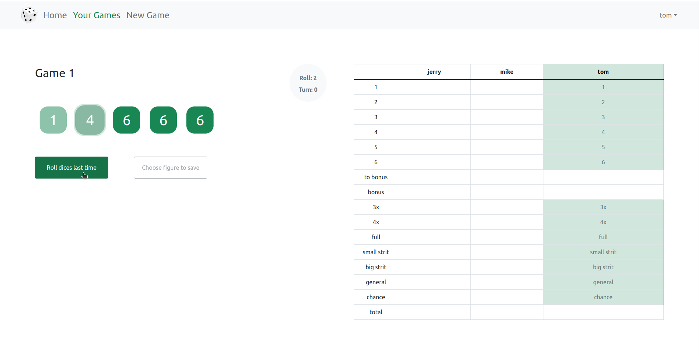


### Last roll
Now you can see what dice numbers on these devices have changed.
Let's say that we want to again roll the first two dice. 
Check them and press the same button.
Remember it is your last roll in this turn.


### Choose figure
Now you have to choose a figure. 
Consider the best option for you and mark the figure on the table.


Then press the "Save figure" button to finish your turn. 
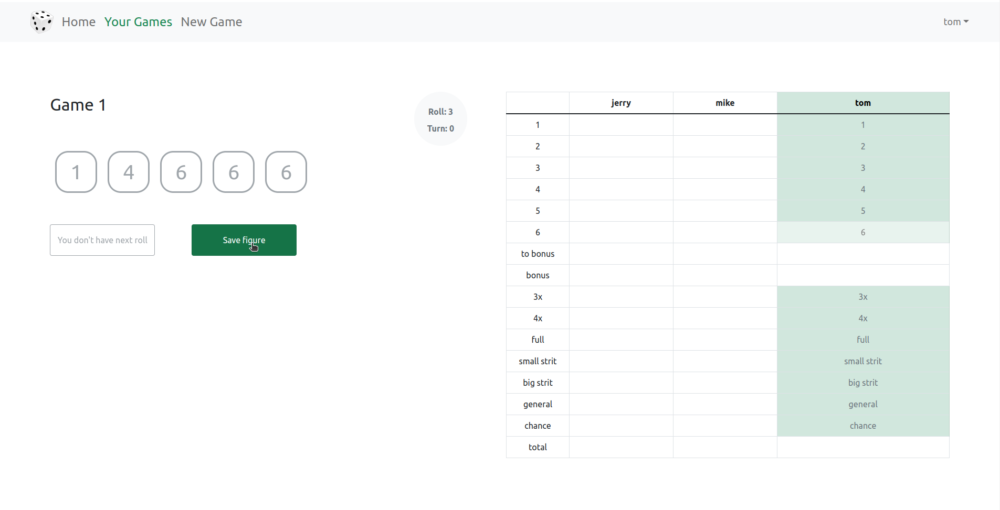


### Wait for others
Now you have nothing to do in this turn.
In the table will appear the result. 
Also there appears information on how many points you need to gain to get a bonus.
Wait for others. 

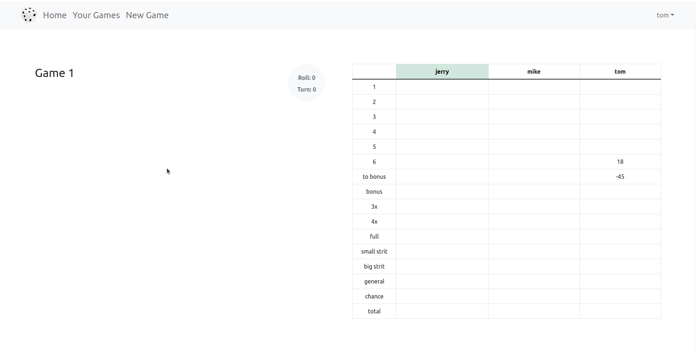

You can watch how other players are playing in real time! 

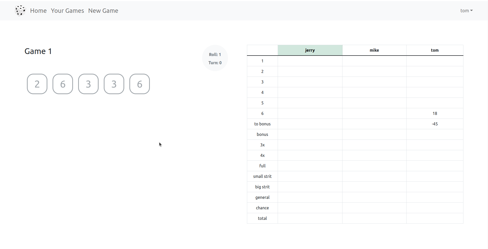

### Check your games
If you wait for other players you can check your other games.
To do it go to Your Games page.
Moreover this text in the tab will be highlighted green if you have any game where other players are waiting for your move.
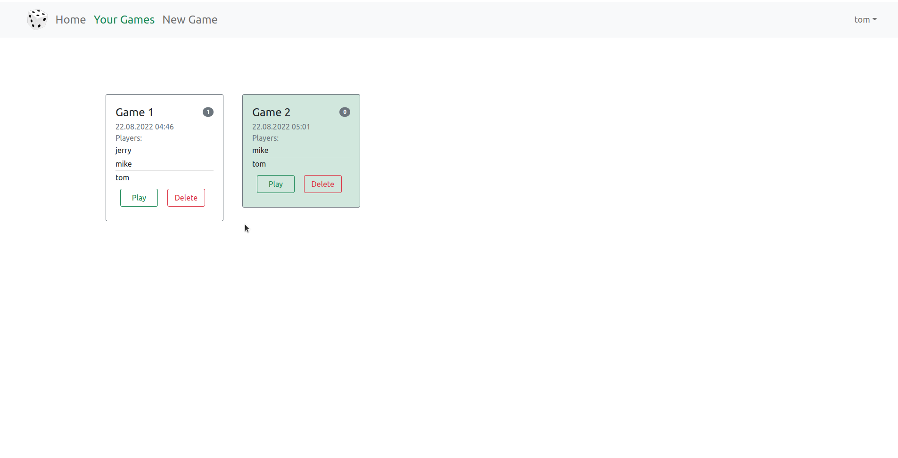


## Administrator Tools
If you installed admin tools you also have access to the admin console in keycloak and mongo-express. These tools are available under:

- for Keycloak http://dice-game-admin/
- and for Mongo Express http://dice-game-admin/db/
### Keycloak admin console
You can modify your login and registration settings. You also can add authentication providers 

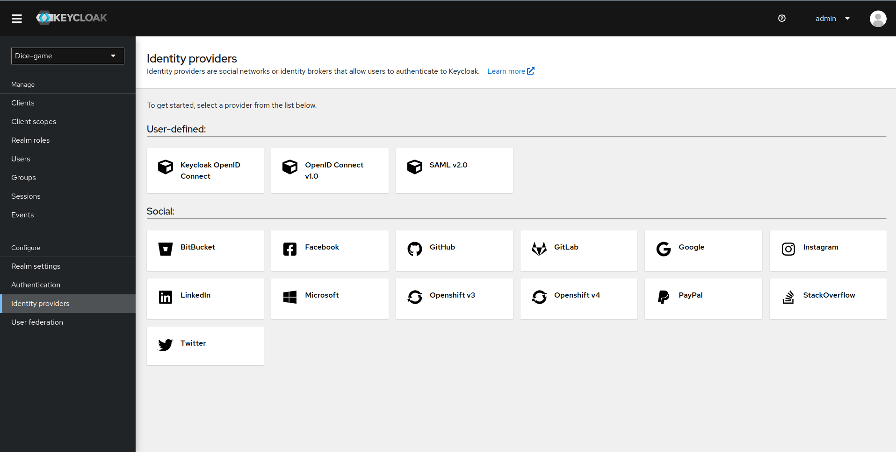


### Mongo express
You can view and delete some games directly in the console.
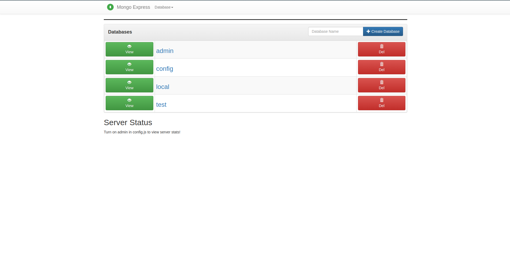
