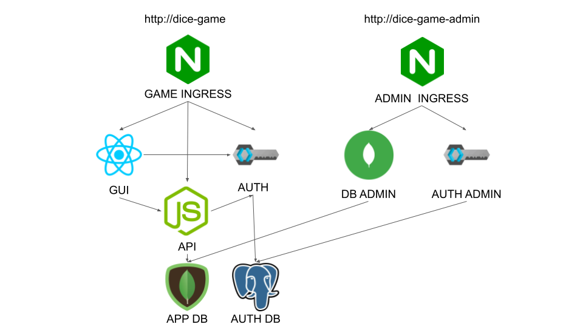

# DICE GAME

## Abstract
Dice game is a simple game when you play with other users. 
The aim of the game is to score the highest number of points. 
Check the tutorial below to learn how to play. 
You need to know that the game is only available for login users.

## Technologies
- Kubernetes
- NodeJS
- ExpressJS
- MongoDB
- Mongo-Express
- React
- Bootstrap
- Nginx
- Keycloak
- Postgres

## Description
You find a few sections in this document. 
Below the current section Description you will find Requirements and below them the Installation where you can see how to install Dice Game. Next to you will find a Tutorial section where it is explained how to work with this application. There you can find how to play the game by GUI and how to use API. Now I will explain a little more how the Dice game works because it is quite a complex system. 

Users have access to Graphical User Interface (GUI) and Application Programming Interface (API).
Graphical interface is build in *React* and for style this application it uses *Bootstrap*. Run this app I use *nginx* service.

API is built in NodeJS. It uses the Express framework. For Connection the database it uses *mongoose* module. It is also strongly covered by *units test* which are very important for further development.

Every user which want to play the game need to be login so 
there is also authentication service delivered by *Keycloak*.
Every user has access to get other users by keycloak so there is no need to have user management service. User can create his account manually or he can login by some authentication provider like Google, Facebook, Github. It is configurable by admin.

Administrator has access to *Keycloak Admin Console* and to *Mongo-Express* in order to manage an application.
The important thing is that it isn't necessary to install administrator tools to play the game.

System use *Kubernetes* to run. Every component of the system run as separate kubernete deployment so every of them is deployed as a kubernetes pod. It allows it to scale itself when trafic growns and overall gives it all kubernetes features. On the graph below you can see the communication matrix between pods. 



## Requirements
- Minikube

## Installation process
You need to do steps below to install this project.

### Install minikube
To install this project you have to need a kubernetes cluster.
The easiest way to get it is install Minikube and kubectl.
Next you need to enable an ingress.
```
minikube addons enable ingress
```
### Install base project
If you properly configure minikube you can install Dice Game. To do that just execute kubectl command below
It will create a two databases Mongo and Postgres, Keycloak authenticator provider and Dice Game API and Dice Game GUI deployment
```
kubectl create -f https://raw.githubusercontent.com/Bartosz95/dice-game/master/k8s/dice-game.yaml
```
### Install admin manager
You can also install Keycloak admin console and Mongo Express to manage games.
```
kubectl create -f https://raw.githubusercontent.com/Bartosz95/dice-game/master/k8s/dice-game-admin.yaml
```
### Set the DNS in hosts
You also need to set your path to application in /etc/hosts on linux.
If you work on another machine, check yourself how to do it.
First you need to know what your minikube IP address is.
```
sudo echo "$(minikube ip) dice-game dice-game-admin" > /etc/hosts
```
It is all now you can open a http://dice-game/ and play.

## Tutorial
To play the game open http://dice-game/. If you install admin console check a next section too

How to use this application? It is very simple. Just check the steps below.

### Login
In the first place you need to be logged in when you want to play this game.
Press the login button on the top right corner of the page to see a login page.
If you have an account you can log in yourself now.
If you don't have any please create one. 
You can also login with available authentication providers as Google, Facebook ect.
You can also create an account manually.
To do that please press the Register button on the bottom of the form.


### Register
Register form is quite conventional. 
You need to give your name and email address. 
Choose your username carefully because it will be displayed for other users in the game.


### Create Game
First go to the New Game tab. 
You will see game creators like below. 
Choose the title for your game and add users. 
After you press the "Create" button you will automatically start playing the game.


### Roll all 5 dices
When you start a new game you will see a page like below.  
Generally the green fields are interactive.
First you need to roll all the dice.
Press the green "Roll all dices" button to make a move.


### Second roll
Now you can see what dice numbers you have. 
You have to decide whether you want to choose a figure or continue playing.
Let's assume that you want to roll the first two dice.
Mark them firstly.


After you check the dicess press the "Roll the dice" button.


### Last roll
Now you can see what dice numbers on these devices have changed.
Let's say that we want to again roll the first two dice. 
Check them and press the same button.
Remember it is your last roll in this turn.


### Choose figure
Now you have to choose a figure. 
Consider the best option for you and mark the figure on the table.


Then press the "Save figure" button to finish your turn. 


### Wait for others
Now you have nothing to do in this turn.
In the table will appear the result. 
Also there appears information on how many points you need to gain to get a bonus.
Wait for others. 


You can watch how other players are playing in real time! 


### Check your games
If you wait for other players you can check your other games.
To do it go to Your Games page.
Moreover this text in the tab will be highlighted green if you have any game where other players are waiting for your move.


## Administrator Tools
If you installed admin tools you also have access to the admin console in keycloak and mongo-express. These tools are available under:

- for Keycloak http://dice-game-admin/
- and for Mongo Express http://dice-game-admin/db/
### Keycloak admin console
You can modify your login and registration settings. You also can add authentication providers 


### Mongo express
You can view and delete some games directly in the console.


## Use REST API to play 
Second way to play Dice Game is to use the API. Below I described which commands are available for players.
I use *curl*,*grep and *jq* in *bash* in my examples.
I also strongly recommend you to install *jq* application to work easily with json response, it helps a lot.

### Login
For all requests you have to have an access token that's why you get it by login in the first place.
Command below save token in *TOKEN* variable.
```
 export TOKEN=$(curl -X POST -k 'https://dice-game/auth/realms/dice-game/protocol/openid-connect/token' \
 --header 'Content-Type: application/x-www-form-urlencoded' \
 --data-urlencode 'grant_type=password' \
 --data-urlencode 'client_id=dice-game' \
 --data-urlencode 'username=bartek' \
 --data-urlencode 'password=password' | jq .access_token -r)
```
Next you have access to the application.
If you want to see all available commands you can send GET requests like below. In response you will get examples of all available requests.
```
curl https://dice-game/api/v1/ | jq
```
First you should create a new game. 
To do that you need to know what users are available for playing.
Display all user by request 
```
curl -k https://dice-game/auth/admin/realms/dice-game/users \ 
-H 'Content-type: application/json;charset=UTF-8' \
-H "Authorization: Bearer $TOKEN" \
| jq | grep 'id\|username'
```
In response you will get a list of id and username.
```

```
For every user ID of players should be displayed first and below should be his username. 
Choose your players to game and dle name of game and execute command below. 
```
    curl -X POST http://dice-game/api/v1/game \
    -H 'Content-type: application/json; charset=UTF-8' \
    -H "Authorization: Bearer $TOKEN" \
    -d '{ \
        "users": [ { \
            "id": "3281cc50-a5fe-44cb-b629-f94d3a45d42a", \
            "username": "tom" \
        }, { \
            "id": "3281cc50-a5fe-44cb-b629-f94d3a45d42d", \
            "username": "ana" \
        } ], \
        "name": "Game 1" \
    }' | jq

```
Response should 
```
    {
        _id: '622cd907f6026dbf7cad27ef'
        playerIDs: [
            '3281cc50-a5fe-44cb-b629-f94d3a45d42d', 
            '3281cc50-a5fe-44cb-b629-f94d3a45d42a', 
            '3281cc50-a5fe-44cb-b629-f94d3a45d42c'
        ],
        currentPlayer: '3281cc50-a5fe-44cb-b629-f94d3a45d42c
    }
```

Next You can get your game and play it.

```
curl http://dice-game/api/v1/game/622cd907f6026dbf7cad27ef | jq
```
. Roll the dice by sending POST requests
```
    curl -X POST http://dice-game/api/v1/game \
    -H 'Content-type: application/json;charset=UTF-8' \
    -H "Authorization: Bearer $TOKEN" \
    -d '{ "numbersToChange": ["0", "1", "4"] }' | jq
```
You can also choose your figure by sending a request with the figure.
Remember if you choose figure and dice dice will be omitted but figure saved.
```
    curl -X POST http://dice-game/api/v1/game/622cd907f6026dbf7cad27ef \
    -H 'Content-type: application/json;charset=UTF-8' \
    -H "Authorization: Bearer $TOKEN" \
    -d '{ "chosenFigure": "small strit" }' | jq
```
You can also pull all your games. To do that send the request below.
```
    curl http://dice-game/api/v1/game/622cd907f6026dbf7cad27ef \
    -H 'Content-type: application/json;charset=UTF-8' \
    -H "Authorization: Bearer $TOKEN" | jq
```
Delete your game by request.
```
    curl -X DELETE http://dice-game/api/v1/game/622cd907f6026dbf7cad27ef \
    -H 'Content-type: application/json;charset=UTF-8' \
    -H "Authorization: Bearer $TOKEN" | jq
```
Also you can delete all your games.
```
    curl -X DELETE http://dice-game/api/v1/game \
    -H 'Content-type: application/json;charset=UTF-8' \
    -H "Authorization: Bearer $TOKEN" | jq
```